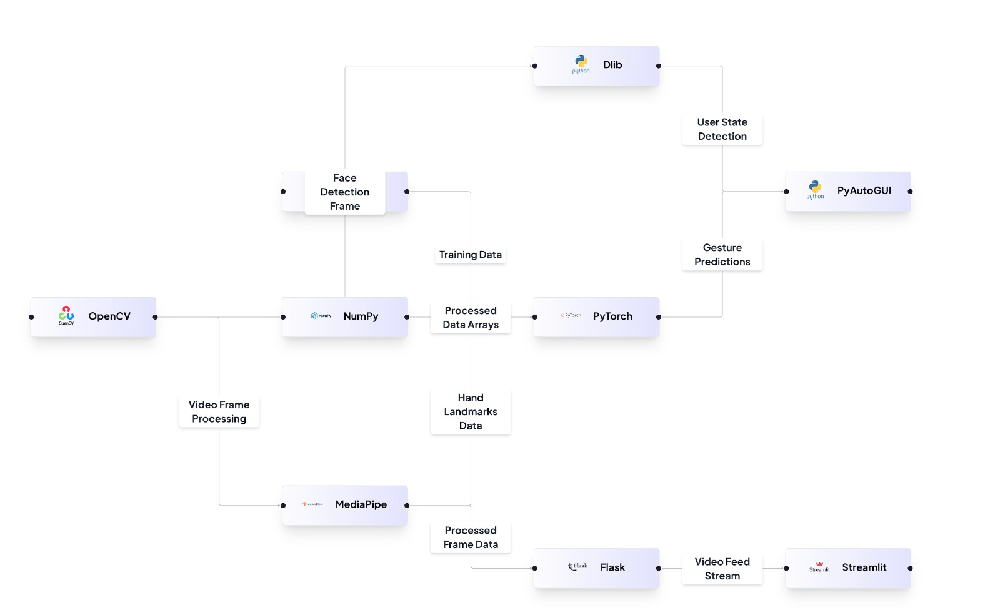

# Gesture-Based YouTube Control System

## Overview
The **Gesture-Based YouTube Control System** implements a real-time gesture-based YouTube control system using computer vision and machine learning techniques. This system enhances accessibility, improves user experience, and increases operational efficiency, especially for users with limited mobility.

## Key Features

### 🖐️ **Hand Gesture Recognition**
- Utilizes **MediaPipe** for hand detection and landmark extraction, providing **21 3D hand landmarks**.
- A pre-trained **Multilayer Perceptron (MLP)** model classifies hand gestures from processed landmark data, enabling control actions.

### 🎮 **YouTube Player Control**
- Hand gestures are mapped to specific YouTube player controls like **play/pause, volume up/down, forward/backward, and fullscreen**.
- **PyAutoGUI** simulates mouse and keyboard inputs based on recognized gestures, controlling the YouTube player.

### 💤 **User State Detection (Sleepiness and Absence)**
- **Dlib's face landmark detection** calculates **Eye Aspect Ratio (EAR)** for sleepiness detection.
- **MediaPipe's face detection** monitors user presence, pausing the video when the user is absent for a certain duration.

### 🌐 **Web Application Interface (Flask)**
- A **Flask web application** provides a user interface for inputting YouTube video links.
- The application streams video feed from the webcam, displaying **real-time hand gesture recognition** results and controlling the YouTube player accordingly.

### 📊 **Data Collection and Model Training**
- Allows **recording and labeling** of new hand gesture data for model training.
- The **MLP model** can be retrained with new data to improve gesture recognition accuracy and expand the system's capabilities.

## 🔧 System Architecture


## 📌 Installation
```bash
# Clone the repository
git clone https://github.com/your-username/gesture-youtube-control.git
cd gesture-youtube-control

# Install dependencies
pip install -r requirements.txt
```

## 🚀 Usage
```bash
python main.py
```
1. Ensure your webcam is enabled.
2. Perform predefined gestures to control YouTube playback.
3. Enjoy hands-free video interaction!

## 🛠️ Technologies Used
- **Python**
- **OpenCV** (for video frame processing)
- **MediaPipe** (for hand and face tracking)
- **Dlib** (for face landmark detection)
- **NumPy** (for data processing)
- **PyTorch** (for gesture recognition model)
- **PyAutoGUI** (for simulating keyboard/mouse inputs)
- **Flask** (for backend integration)
- **Streamlit** (for UI rendering)

## 📝 Future Enhancements
- Support for customizable gestures.
- Integration with additional video platforms.
- Machine learning improvements for better gesture recognition.

## 🤝 Contributing
Contributions are welcome! Feel free to fork the repository, create a feature branch, and submit a pull request.

## 📄 License
This project is licensed under the MIT License - see the [LICENSE](LICENSE) file for details.

---
**🚀 Hands-Free YouTube Control for an Effortless Viewing Experience!**

